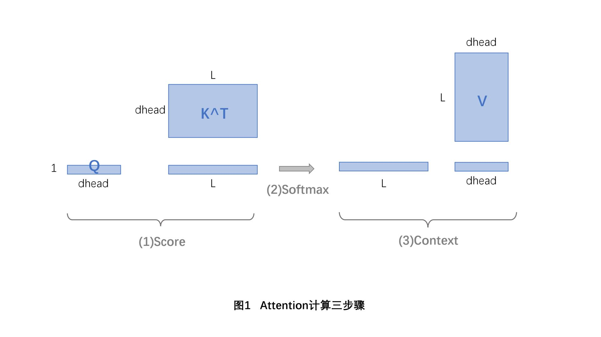
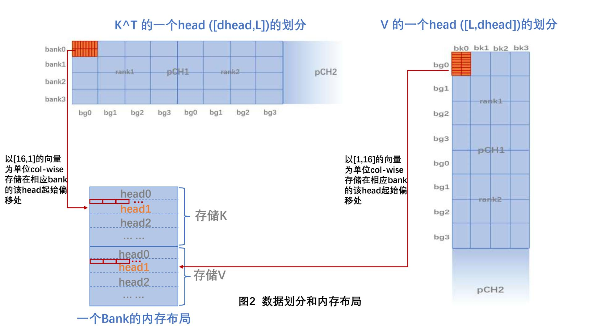
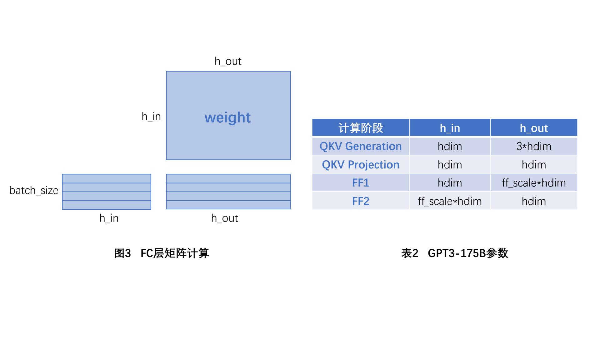
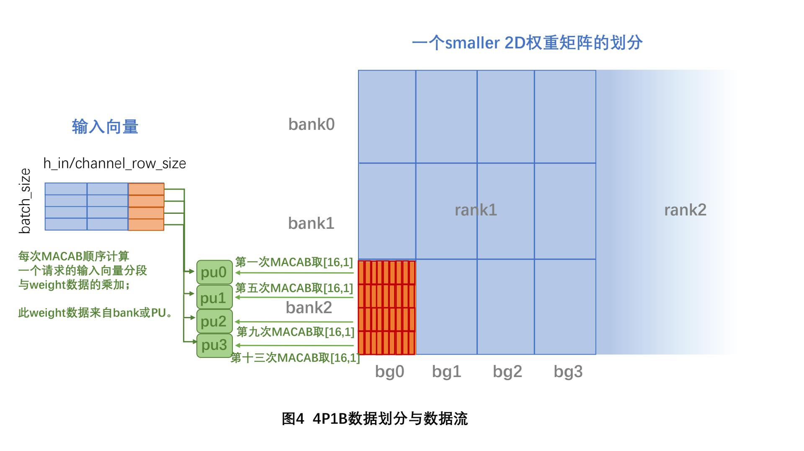
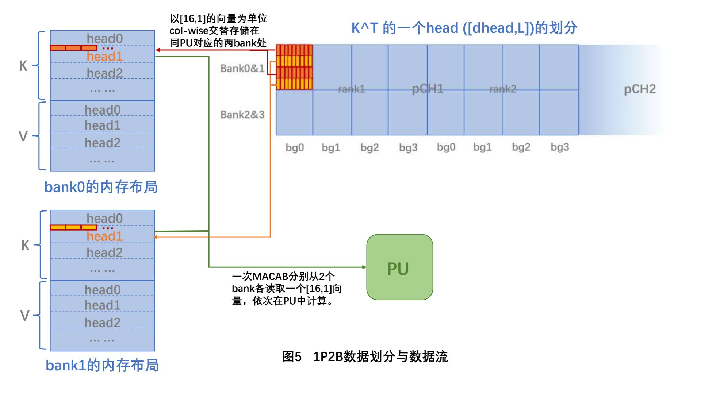

# PAPI复现说明

## 一、FC-PIM和Attn-PIM的实现
AttAcc基于Ramulator2实现了1P1B的HBM3-PIM模块，专门用于加速Attention计算。PAPI在此基础上修改，得到了4P1B的FC-PIM和1P2B的Attn-PIM。

由于此方法对于kernel在PIM上的任务划分、数据布局等方面都有特定的要求，因此，这部分复现包含两个核心 —— **Ramulator2仿真器的修改**和**trace生成脚本的设计**。其中后者是最难的部分。

| Interface         | FC-PIM Implementation     | Attn-PIM Implementation  |
| ----------------- | ------------------------- |------------------------- |
| Frontend          | `AttnPIMLoadStoreTrace`   |`FCPIMLoadStoreTrace`     |
| Memory System     | `AttnPIMDRAMSystem`       |`FCPIMDRAMSystem`         |
| DRAM Device       | `Attn-PIM`                |`FC-PIM`                  |
| Address Mapper    | `AttnPIMMap`              |`FCPIMMap`                |
| DRAM Controller   | `AttnPIMController`       |`FCPIMController`         |
| Request Scheduler | `PIM`                     |`PIM`                     |
| Refresh Manager   | `AllBankRefreshHBM3`      |`AllBankRefreshHBM3`      |
| Plugin            | `HBM3TraceRecorder`       |`HBM3TraceRecorder`       |

> 表1   FC-PIM和Attn-PIM在Ramulator2中各接口的实现
### （一）AttAcc中1P1B的设计
Attention计算分成`score`→`softmax`→`context`三步骤，如下图。其中1P1B 设计的GEMV Units主要用于`score`和`context`步骤的计算。

在GEMV计算时，发出`PIM_MAC_AB`请求，PIM会执行`MACAB`命令：在所有bank的相同位置取出32B数据，传给每个bank的PU；一个PU含有16个乘法单元，刚好可以一次性完成16个FP16数据的计算。

这样的命令对于数据的存放位置提出了严格的要求。AttAcc采取的数据划分策略是：在HBM和Channel级是head-wise划分;对于K^T,在pCH、Rank、BG级都是col-wise划分，而Bank和multiplier级是row-wise；矩阵V恰好相反。

由于一个channel可以处理多个head，所以每个bank被划分成了K和V两个分区，每个分区需要存储该channel每个head的部分内容。

在K^T中，由于其在multiplier级是row-wise划分的，因此每次`MACAB`命令会读取一个[16,1]形状的向量给PU计算，直至将矩阵在bank中存储的内容都读取完毕。在矩阵乘法中，为了保证计算连续性，必然是一列一列按顺序计算的，因此可推测：其在HBM中是以[16,1]的向量为粒度，采取列优先的策略存储的。如下图所示：

### （二）FC-PIM（4P1B）
根据PAPI的设计，当FC kernel处于memory-bound时，将其调度到FC-PIM中计算。为了提高数据复用程度，以降低能耗，FC-PIM设计为4P1B架构。

不过，由于论文中有部分细节没有详细指出，因此下述实现中存在自由发挥。
#### 任务划分
以GPT3-175B模型为例，FC layer主要下表2所示的4个计算阶段；在多请求并行的推理过程中，每个阶段都是GEMM计算，只是矩阵形状有所不同。

PAPI对于FC layer的权重矩阵的任务划分策略是：在Channel级将整个矩阵划分成多个更小的二维矩阵，然后在pCH、Rank、BG级按col-wise划分，在Bank、PU、Multiplier级按row-wise划分。由于不同计算阶段的权重矩阵形状不同，我对Channel级的任务划分设计了4×4、2×8和8×2三种方式，分别对应 h_in =/</> h_out的情况。

#### 计算原理
**FC-PIM通过增加每个bank中的PU数量来提高数据复用程度，即bank中一个打开的行的连续访问次数**。每次`MACAB`命令会取出一个[16,1]向量，按照PU0、PU1、PU2、PU3、PU0......的顺序传给本次对应的PUx做计算；**在PUx中还存在weight向量的复用**：对PUx连续发出batch_size个`PIM_MAC_AB`请求，除第一次外，其余的不再需要从DRAM中读取数据，而是直接用PU中的weight向量计算。

其中需要注意的一点是：在多请求并行的环境中，相比AttAcc原始的1P1B设计，这里PUx的连续计算延时增加了(batch_size-1)倍，我们需要保证`4×batch_size`个`MACAB`命令之后再次轮到此PUx时，已经将batch_size个请求的数据都计算完毕。这里，我设置了batch_size=8，假定再次轮到PUx时一定已经完成了8个请求的计算。**可以理解为：在4P1B的配置下，多请求并行计算的时延被其它PU的执行掩盖。**

#### 代码修改
- Ramulator2部分：
    - 增加了对FC计算涉及的3种请求(`PIM_WR_GB`、`PIM_MAC_AB`、`PIM_RF_GB`)的支持。
    - 增加对`PIM_MAC_AB`多请求时延被覆盖的逻辑处理：若对当前地址的`PIM_MAC_AB`命令已经出现过，说明已经从bank中取来了数据，只需要模拟1个cycle的计算时延，由于此时延被其它PU的计算覆盖，所以直接认定处理完毕。
- Trace生成脚本：
    - 修改了HBM配置：根据PAPI所述的面积限制，每个rank含有3个bank group。其它配置不变。
    - 实现了FC layer在FC-PIM中计算的全流程访存请求：写入数据 → 执行计算 → 读出结果。
### （三）Attn-PIM（1P2B）
PAPI中的Attn-PIM整体沿用了AttAcc中HBM3-PIM的数据划分策略与内存布局，仅将1P1B改成1P2B架构。

论文中并未详细指明1P2B下的数据存储方案和PIM命令行为，因此下述内容属于自由发挥。
#### 计算原理
以K^T为例，我们仍然将矩阵分块以[16,1]的粒度col-wise地存入bank。为了保证矩阵计算的连续性，我们需要将每个[16,1]向量交替存储到同一PU对应的两个bank中。这样，一次`MACAB`命令会同时从两个bank中取出各32B数据，它们依次在PU中用于计算，得到的结果可以直接累加。

由于Attn-PIM中一次`MACAB`需要计算2轮，因此`MACAB`命令执行的总时间延长了一倍的计算时间。

#### 代码修改
- Ramulator2部分：
    - 时序约束：将两个连续`MACAB`命令之间的最小时间间隔`nCCDAB`增加2，表示1P2B模型下PU单次命令计算时间的延长。
- Trace生成脚本：
    - 修改了相应请求的生成逻辑。

## 二、PAPI顶层模块调度的实现
相比之下，PAPI顶层模块的实现在逻辑上并不复杂，主要包含两个方面：

- System.simulate()函数的核心调度逻辑。
    - 参照PAPI原文，使用Dolly数据集，获取其lin、lout数据；
    - 根据论文中指出的动态调度判断方法，每计算一个token，重新统计RLP的值，并判断此时处于compute bound还是memory bound，并对之后的FC layer选择相应的设备。
    - 这里，我设置TLP=1，alpha=3。
- 其它类的一些琐碎工作，比如PIM Wrapper的编写、config参数设置等。需要注意的是，由于缺乏标准数据的参考，对于一些能耗相关的参数目前使用的是AI模拟的数据。